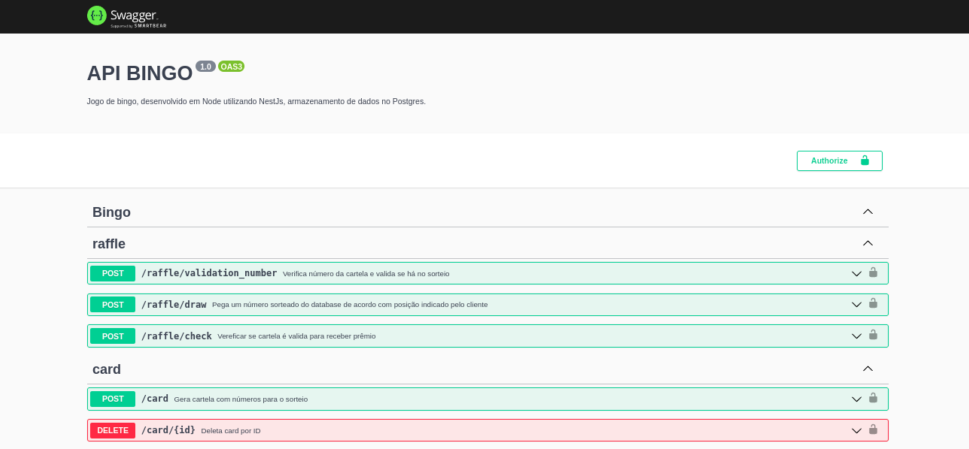

<h1 align="center">
   PROJETO BINGO RED API 
</h1>

> Bingo Red Api é uma aplicação game. Server side feito com NestJS.

## 🚀 API

## 👩‍💻 Veja o desenvolvimento do projeto:

## 💻 Protótipo

## 🤝 Colaboradores

<table>
  <tr>
    <td align="center">
      <a href="#">
         
        
          <b>Bruno Dutra</b>
        
      </a>
    </td>
    <td align="center">
      <a href="#">
         
        
          <b>Diego Carravetta</b>
        
      </a>
    </td>
    <td align="center">
      <a href="#">
         
        
          <b>Fredy</b>
        
      </a>
    </td>
    <td align="center">
      <a href="#">
         
        
          <b>Guilherme Mattoso</b>
        
      </a>
    </td>
       <td align="center">
      <a href="#">
         
        
          <b>Nilson Reis</b>
        
      </a>
    </td>
       <td align="center">
      <a href="#">
         
        
          <b>Tiago Lima</b>
        
      </a>
    </td>
    </td>
  </tr>
</table>

## 📱 Contato

> BRUNO DUTRA  
 

> DIEGO CARRAVETTA  

> FREDY  

> GUILHERME MATTOSO  

> NILSON REIS   

> TIAGO LIMA   

